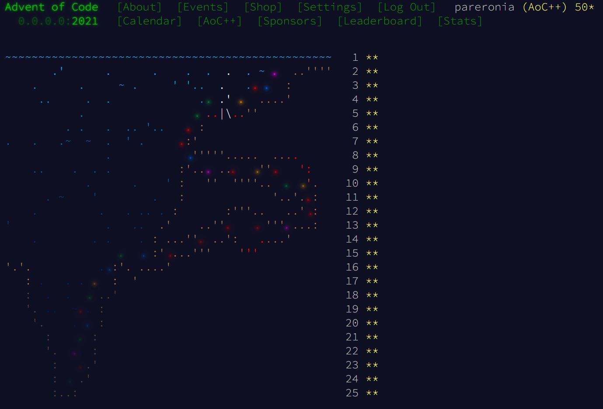
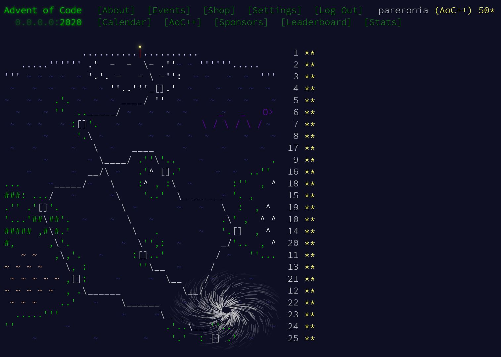
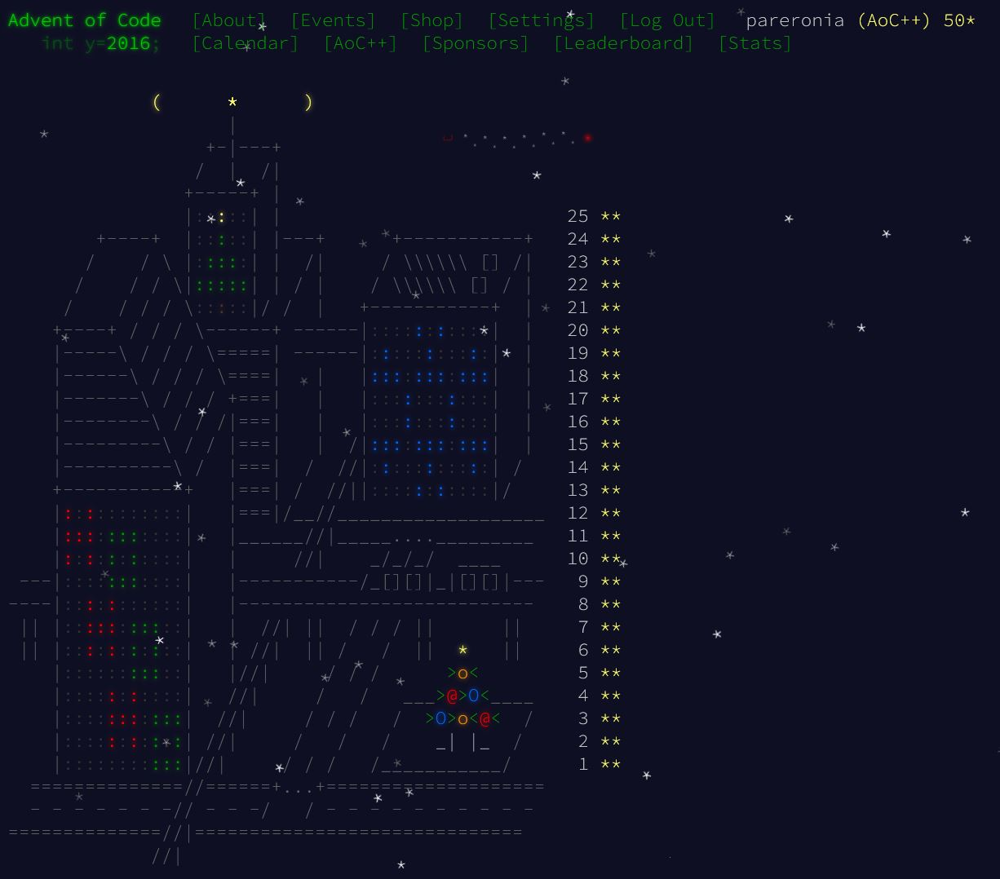
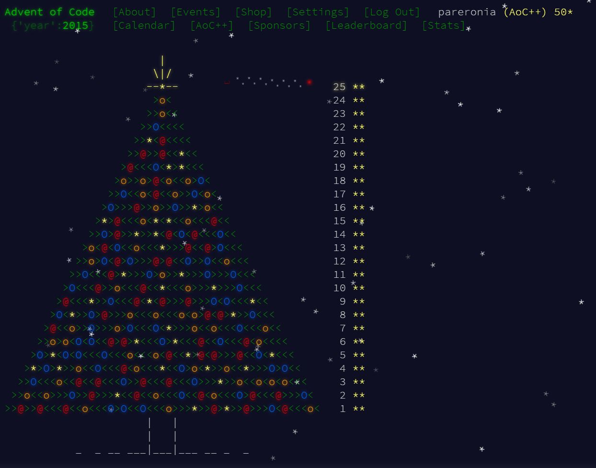

[Advent of Code](https://adventofcode.com)

## 2021

<!-- @BEGIN:ImplementationsTable:2021@ -->
| | 1 | 2 | 3 | 4 | 5 | 6 | 7 | 8 | 9 | 10 | 11 | 12 | 13 | 14 | 15 | 16 | 17 | 18 | 19 | 20 | 21 | 22 | 23 | 24 | 25 |
| ---| --- | --- | --- | --- | --- | --- | --- | --- | --- | --- | --- | --- | --- | --- | --- | --- | --- | --- | --- | --- | --- | --- | --- | --- | --- |
| python3 | [✓](src/main/python/AoC2021_01.py) | [✓](src/main/python/AoC2021_02.py) | [✓](src/main/python/AoC2021_03.py) | [✓](src/main/python/AoC2021_04.py) | [✓](src/main/python/AoC2021_05.py) | [✓](src/main/python/AoC2021_06.py) | [✓](src/main/python/AoC2021_07.py) | [✓](src/main/python/AoC2021_08.py) | [✓](src/main/python/AoC2021_09.py) | [✓](src/main/python/AoC2021_10.py) | [✓](src/main/python/AoC2021_11.py) | [✓](src/main/python/AoC2021_12.py) | [✓](src/main/python/AoC2021_13.py) | [✓](src/main/python/AoC2021_14.py) | [✓](src/main/python/AoC2021_15.py) | [✓](src/main/python/AoC2021_16.py) | [✓](src/main/python/AoC2021_17.py) | [✓](src/main/python/AoC2021_18.py) |  | [✓](src/main/python/AoC2021_20.py) | [✓](src/main/python/AoC2021_21.py) | [✓](src/main/python/AoC2021_22.py) | [✓](src/main/python/AoC2021_23.py) | [✓](src/main/python/AoC2021_24.py) | [✓](src/main/python/AoC2021_25.py) |
| java | [✓](src/main/java/AoC2021_01.java) | [✓](src/main/java/AoC2021_02.java) | [✓](src/main/java/AoC2021_03.java) | [✓](src/main/java/AoC2021_04.java) | [✓](src/main/java/AoC2021_05.java) | [✓](src/main/java/AoC2021_06.java) | [✓](src/main/java/AoC2021_07.java) | [✓](src/main/java/AoC2021_08.java) | [✓](src/main/java/AoC2021_09.java) | [✓](src/main/java/AoC2021_10.java) | [✓](src/main/java/AoC2021_11.java) | [✓](src/main/java/AoC2021_12.java) | [✓](src/main/java/AoC2021_13.java) | [✓](src/main/java/AoC2021_14.java) | [✓](src/main/java/AoC2021_15.java) | [✓](src/main/java/AoC2021_16.java) | [✓](src/main/java/AoC2021_17.java) | [✓](src/main/java/AoC2021_18.java) | [✓](src/main/java/AoC2021_19.java) | [✓](src/main/java/AoC2021_20.java) | [✓](src/main/java/AoC2021_21.java) | [✓](src/main/java/AoC2021_22.java) | [✓](src/main/java/AoC2021_23.java) | [✓](src/main/java/AoC2021_24.java) | [✓](src/main/java/AoC2021_25.java) |
| bash | [✓](src/main/bash/AoC2021_01.sh) | [✓](src/main/bash/AoC2021_02.sh) |  |  |  |  |  |  |  |  |  |  | [✓](src/main/bash/AoC2021_13.sh) |  |  |  |  |  |  |  |  |  |  |  |  |
| c++ | [✓](src/main/cpp/2021/01/AoC2021_01.cpp) | [✓](src/main/cpp/2021/02/AoC2021_02.cpp) | [✓](src/main/cpp/2021/03/AoC2021_03.cpp) |  |  |  |  |  |  |  |  |  |  | [✓](src/main/cpp/2021/14/AoC2021_14.cpp) | [✓](src/main/cpp/2021/15/AoC2021_15.cpp) |  |  |  |  |  |  |  |  |  |  |
<!-- @END:ImplementationsTable:2021@ -->

## 2020

<!-- @BEGIN:ImplementationsTable:2020@ -->
| | 1 | 2 | 3 | 4 | 5 | 6 | 7 | 8 | 9 | 10 | 11 | 12 | 13 | 14 | 15 | 16 | 17 | 18 | 19 | 20 | 21 | 22 | 23 | 24 | 25 |
| ---| --- | --- | --- | --- | --- | --- | --- | --- | --- | --- | --- | --- | --- | --- | --- | --- | --- | --- | --- | --- | --- | --- | --- | --- | --- |
| python3 | [✓](src/main/python/AoC2020_01.py) | [✓](src/main/python/AoC2020_02.py) | [✓](src/main/python/AoC2020_03.py) | [✓](src/main/python/AoC2020_04.py) | [✓](src/main/python/AoC2020_05.py) | [✓](src/main/python/AoC2020_06.py) | [✓](src/main/python/AoC2020_07.py) | [✓](src/main/python/AoC2020_08.py) | [✓](src/main/python/AoC2020_09.py) | [✓](src/main/python/AoC2020_10.py) | [✓](src/main/python/AoC2020_11.py) | [✓](src/main/python/AoC2020_12.py) | [✓](src/main/python/AoC2020_13.py) | [✓](src/main/python/AoC2020_14.py) | [✓](src/main/python/AoC2020_15.py) | [✓](src/main/python/AoC2020_16.py) | [✓](src/main/python/AoC2020_17.py) | [✓](src/main/python/AoC2020_18.py) | [✓](src/main/python/AoC2020_19.py) | [✓](src/main/python/AoC2020_20.py) | [✓](src/main/python/AoC2020_21.py) | [✓](src/main/python/AoC2020_22.py) | [✓](src/main/python/AoC2020_23.py) | [✓](src/main/python/AoC2020_24.py) | [✓](src/main/python/AoC2020_25.py) |
| java | [✓](src/main/java/AoC2020_01.java) | [✓](src/main/java/AoC2020_02.java) | [✓](src/main/java/AoC2020_03.java) | [✓](src/main/java/AoC2020_04.java) | [✓](src/main/java/AoC2020_05.java) | [✓](src/main/java/AoC2020_06.java) | [✓](src/main/java/AoC2020_07.java) | [✓](src/main/java/AoC2020_08.java) | [✓](src/main/java/AoC2020_09.java) | [✓](src/main/java/AoC2020_10.java) |  | [✓](src/main/java/AoC2020_12.java) | [✓](src/main/java/AoC2020_13.java) |  | [✓](src/main/java/AoC2020_15.java) |  |  |  |  | [✓](src/main/java/AoC2020_20.java) |  | [✓](src/main/java/AoC2020_22.java) | [✓](src/main/java/AoC2020_23.java) |  |  |
| bash |  |  |  |  |  |  |  |  |  |  |  |  |  |  |  |  |  |  |  |  |  |  |  |  |  |
| c++ |  |  |  |  |  |  |  |  |  |  |  |  |  |  |  |  |  |  |  |  |  |  |  |  |  |
<!-- @END:ImplementationsTable:2020@ -->

## 2019

<!-- @BEGIN:ImplementationsTable:2019@ -->
| | 1 | 2 | 3 | 4 | 5 | 6 | 7 | 8 | 9 | 10 | 11 | 12 | 13 | 14 | 15 | 16 | 17 | 18 | 19 | 20 | 21 | 22 | 23 | 24 | 25 |
| ---| --- | --- | --- | --- | --- | --- | --- | --- | --- | --- | --- | --- | --- | --- | --- | --- | --- | --- | --- | --- | --- | --- | --- | --- | --- |
| python3 | [✓](src/main/python/AoC2019_01.py) | [✓](src/main/python/AoC2019_02.py) | [✓](src/main/python/AoC2019_03.py) | [✓](src/main/python/AoC2019_04.py) |  | [✓](src/main/python/AoC2019_06.py) |  | [✓](src/main/python/AoC2019_08.py) |  |  |  |  |  |  |  |  |  |  |  |  |  |  |  |  |  |
| java | [✓](src/main/java/AoC2019_01.java) | [✓](src/main/java/AoC2019_02.java) | [✓](src/main/java/AoC2019_03.java) | [✓](src/main/java/AoC2019_04.java) | [✓](src/main/java/AoC2019_05.java) | [✓](src/main/java/AoC2019_06.java) |  | [✓](src/main/java/AoC2019_08.java) |  |  |  |  |  |  |  |  |  |  |  |  |  |  |  |  |  |
| bash |  |  |  |  |  |  |  | [✓](src/main/bash/AoC2019_08.sh) |  |  |  |  |  |  |  |  |  |  |  |  |  |  |  |  |  |
| c++ |  |  |  |  |  |  |  |  |  |  |  |  |  |  |  |  |  |  |  |  |  |  |  |  |  |
<!-- @END:ImplementationsTable:2019@ -->

## 2018

<!-- @BEGIN:ImplementationsTable:2018@ -->
| | 1 | 2 | 3 | 4 | 5 | 6 | 7 | 8 | 9 | 10 | 11 | 12 | 13 | 14 | 15 | 16 | 17 | 18 | 19 | 20 | 21 | 22 | 23 | 24 | 25 |
| ---| --- | --- | --- | --- | --- | --- | --- | --- | --- | --- | --- | --- | --- | --- | --- | --- | --- | --- | --- | --- | --- | --- | --- | --- | --- |
| python3 |  |  |  |  |  |  |  |  |  |  |  |  |  |  |  |  |  |  |  |  |  |  |  |  |  |
| java |  |  |  |  |  |  |  |  |  |  |  |  |  |  |  |  |  |  |  |  |  |  |  |  |  |
| bash |  |  |  |  |  |  |  |  |  |  |  |  |  |  |  |  |  |  |  |  |  |  |  |  |  |
| c++ |  |  |  |  |  |  |  |  |  |  |  |  |  |  |  |  |  |  |  |  |  |  |  |  |  |
<!-- @END:ImplementationsTable:2018@ -->

## 2017

<!-- @BEGIN:ImplementationsTable:2017@ -->
| | 1 | 2 | 3 | 4 | 5 | 6 | 7 | 8 | 9 | 10 | 11 | 12 | 13 | 14 | 15 | 16 | 17 | 18 | 19 | 20 | 21 | 22 | 23 | 24 | 25 |
| ---| --- | --- | --- | --- | --- | --- | --- | --- | --- | --- | --- | --- | --- | --- | --- | --- | --- | --- | --- | --- | --- | --- | --- | --- | --- |
| python3 |  |  |  |  |  |  |  | [✓](src/main/python/AoC2017_08.py) |  |  |  |  |  |  |  |  |  |  |  |  |  |  |  |  |  |
| java | [✓](src/main/java/AoC2017_01.java) | [✓](src/main/java/AoC2017_02.java) | [✓](src/main/java/AoC2017_03.java) | [✓](src/main/java/AoC2017_04.java) | [✓](src/main/java/AoC2017_05.java) | [✓](src/main/java/AoC2017_06.java) | [✓](src/main/java/AoC2017_07.java) | [✓](src/main/java/AoC2017_08.java) | [✓](src/main/java/AoC2017_09.java) | [✓](src/main/java/AoC2017_10.java) |  | [✓](src/main/java/AoC2017_12.java) |  |  |  |  |  |  |  |  |  |  |  |  |  |
| bash | [✓](src/main/bash/AoC2017_01.sh) | [✓](src/main/bash/AoC2017_02.sh) |  | [✓](src/main/bash/AoC2017_04.sh) | [✓](src/main/bash/AoC2017_05.sh) |  |  |  |  |  |  |  |  |  |  |  |  |  |  |  |  |  |  |  |  |
| c++ |  |  |  |  |  |  |  |  |  |  |  |  |  |  |  |  |  |  |  |  |  |  |  |  |  |
<!-- @END:ImplementationsTable:2017@ -->

## 2016

<!-- @BEGIN:ImplementationsTable:2016@ -->
| | 1 | 2 | 3 | 4 | 5 | 6 | 7 | 8 | 9 | 10 | 11 | 12 | 13 | 14 | 15 | 16 | 17 | 18 | 19 | 20 | 21 | 22 | 23 | 24 | 25 |
| ---| --- | --- | --- | --- | --- | --- | --- | --- | --- | --- | --- | --- | --- | --- | --- | --- | --- | --- | --- | --- | --- | --- | --- | --- | --- |
| python3 | [✓](src/main/python/AoC2016_01.py) | [✓](src/main/python/AoC2016_02.py) | [✓](src/main/python/AoC2016_03.py) | [✓](src/main/python/AoC2016_04.py) | [✓](src/main/python/AoC2016_05.py) | [✓](src/main/python/AoC2016_06.py) | [✓](src/main/python/AoC2016_07.py) |  | [✓](src/main/python/AoC2016_09.py) |  |  | [✓](src/main/python/AoC2016_12.py) |  |  | [✓](src/main/python/AoC2016_15.py) | [✓](src/main/python/AoC2016_16.py) |  | [✓](src/main/python/AoC2016_18.py) | [✓](src/main/python/AoC2016_19.py) | [✓](src/main/python/AoC2016_20.py) | [✓](src/main/python/AoC2016_21.py) | [✓](src/main/python/AoC2016_22.py) | [✓](src/main/python/AoC2016_23.py) |  | [✓](src/main/python/AoC2016_25.py) |
| java | [✓](src/main/java/AoC2016_01.java) | [✓](src/main/java/AoC2016_02.java) | [✓](src/main/java/AoC2016_03.java) | [✓](src/main/java/AoC2016_04.java) | [✓](src/main/java/AoC2016_05.java) | [✓](src/main/java/AoC2016_06.java) | [✓](src/main/java/AoC2016_07.java) | [✓](src/main/java/AoC2016_08.java) | [✓](src/main/java/AoC2016_09.java) | [✓](src/main/java/AoC2016_10.java) | [✓](src/main/java/AoC2016_11.java) | [✓](src/main/java/AoC2016_12.java) | [✓](src/main/java/AoC2016_13.java) | [✓](src/main/java/AoC2016_14.java) | [✓](src/main/java/AoC2016_15.java) | [✓](src/main/java/AoC2016_16.java) | [✓](src/main/java/AoC2016_17.java) | [✓](src/main/java/AoC2016_18.java) | [✓](src/main/java/AoC2016_19.java) | [✓](src/main/java/AoC2016_20.java) | [✓](src/main/java/AoC2016_21.java) | [✓](src/main/java/AoC2016_22.java) | [✓](src/main/java/AoC2016_23.java) | [✓](src/main/java/AoC2016_24.java) | [✓](src/main/java/AoC2016_25.java) |
| bash | [✓](src/main/bash/AoC2016_01.sh) | [✓](src/main/bash/AoC2016_02.sh) | [✓](src/main/bash/AoC2016_03.sh) | [✓](src/main/bash/AoC2016_04.sh) |  | [✓](src/main/bash/AoC2016_06.sh) | [✓](src/main/bash/AoC2016_07.sh) | [✓](src/main/bash/AoC2016_08.sh) | [✓](src/main/bash/AoC2016_09.sh) |  |  |  |  |  |  |  |  |  |  |  |  |  |  |  |  |
| c++ |  |  |  |  |  |  |  |  |  |  |  |  |  |  |  |  |  |  |  |  |  |  |  |  |  |
<!-- @END:ImplementationsTable:2016@ -->

## 2015

<!-- @BEGIN:ImplementationsTable:2015@ -->
| | 1 | 2 | 3 | 4 | 5 | 6 | 7 | 8 | 9 | 10 | 11 | 12 | 13 | 14 | 15 | 16 | 17 | 18 | 19 | 20 | 21 | 22 | 23 | 24 | 25 |
| ---| --- | --- | --- | --- | --- | --- | --- | --- | --- | --- | --- | --- | --- | --- | --- | --- | --- | --- | --- | --- | --- | --- | --- | --- | --- |
| python3 | [✓](src/main/python/AoC2015_01.py) | [✓](src/main/python/AoC2015_02.py) | [✓](src/main/python/AoC2015_03.py) | [✓](src/main/python/AoC2015_04.py) | [✓](src/main/python/AoC2015_05.py) | [✓](src/main/python/AoC2015_06.py) |  | [✓](src/main/python/AoC2015_08.py) | [✓](src/main/python/AoC2015_09.py) | [✓](src/main/python/AoC2015_10.py) | [✓](src/main/python/AoC2015_11.py) | [✓](src/main/python/AoC2015_12.py) | [✓](src/main/python/AoC2015_13.py) | [✓](src/main/python/AoC2015_14.py) | [✓](src/main/python/AoC2015_15.py) | [✓](src/main/python/AoC2015_16.py) | [✓](src/main/python/AoC2015_17.py) | [✓](src/main/python/AoC2015_18.py) | [✓](src/main/python/AoC2015_19.py) |  |  |  | [✓](src/main/python/AoC2015_23.py) | [✓](src/main/python/AoC2015_24.py) | [✓](src/main/python/AoC2015_25.py) |
| java | [✓](src/main/java/AoC2015_01.java) | [✓](src/main/java/AoC2015_02.java) | [✓](src/main/java/AoC2015_03.java) | [✓](src/main/java/AoC2015_04.java) | [✓](src/main/java/AoC2015_05.java) | [✓](src/main/java/AoC2015_06.java) | [✓](src/main/java/AoC2015_07.java) | [✓](src/main/java/AoC2015_08.java) | [✓](src/main/java/AoC2015_09.java) | [✓](src/main/java/AoC2015_10.java) | [✓](src/main/java/AoC2015_11.java) | [✓](src/main/java/AoC2015_12.java) | [✓](src/main/java/AoC2015_13.java) | [✓](src/main/java/AoC2015_14.java) |  |  |  |  |  | [✓](src/main/java/AoC2015_20.java) | [✓](src/main/java/AoC2015_21.java) | [✓](src/main/java/AoC2015_22.java) |  |  |  |
| bash | [✓](src/main/bash/AoC2015_01.sh) | [✓](src/main/bash/AoC2015_02.sh) | [✓](src/main/bash/AoC2015_03.sh) | [✓](src/main/bash/AoC2015_04.sh) | [✓](src/main/bash/AoC2015_05.sh) |  |  |  | [✓](src/main/bash/AoC2015_09.sh) | [✓](src/main/bash/AoC2015_10.sh) |  |  |  | [✓](src/main/bash/AoC2015_14.sh) |  |  |  |  |  |  |  |  |  |  |  |
| c++ |  |  |  |  |  |  |  |  |  |  |  |  |  |  |  |  |  |  |  |  |  |  |  |  |  |
<!-- @END:ImplementationsTable:2015@ -->
