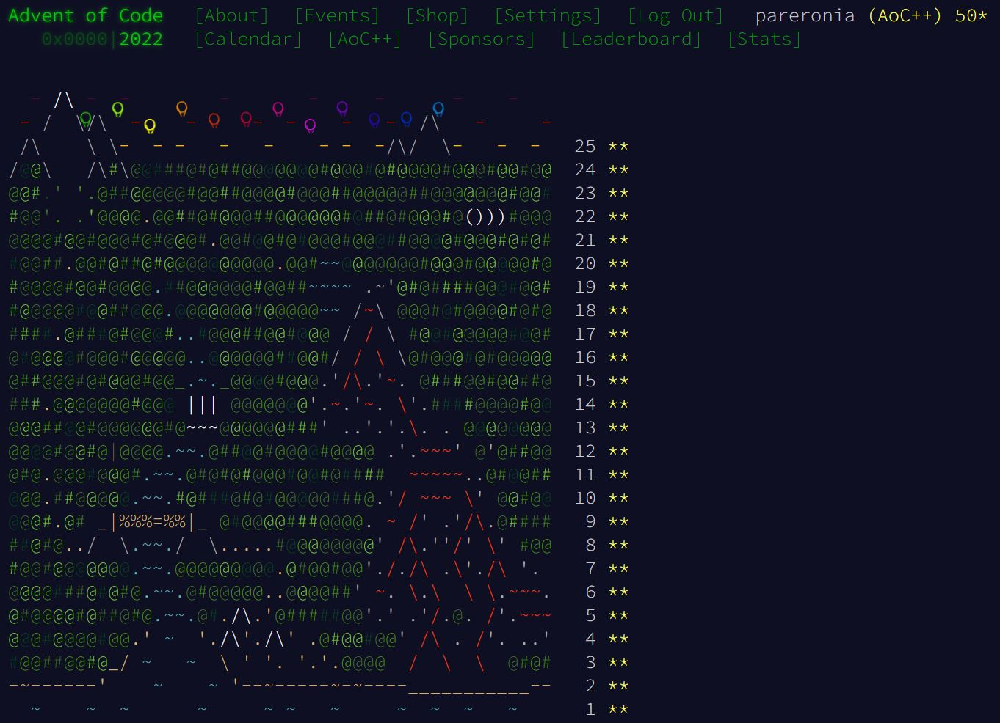
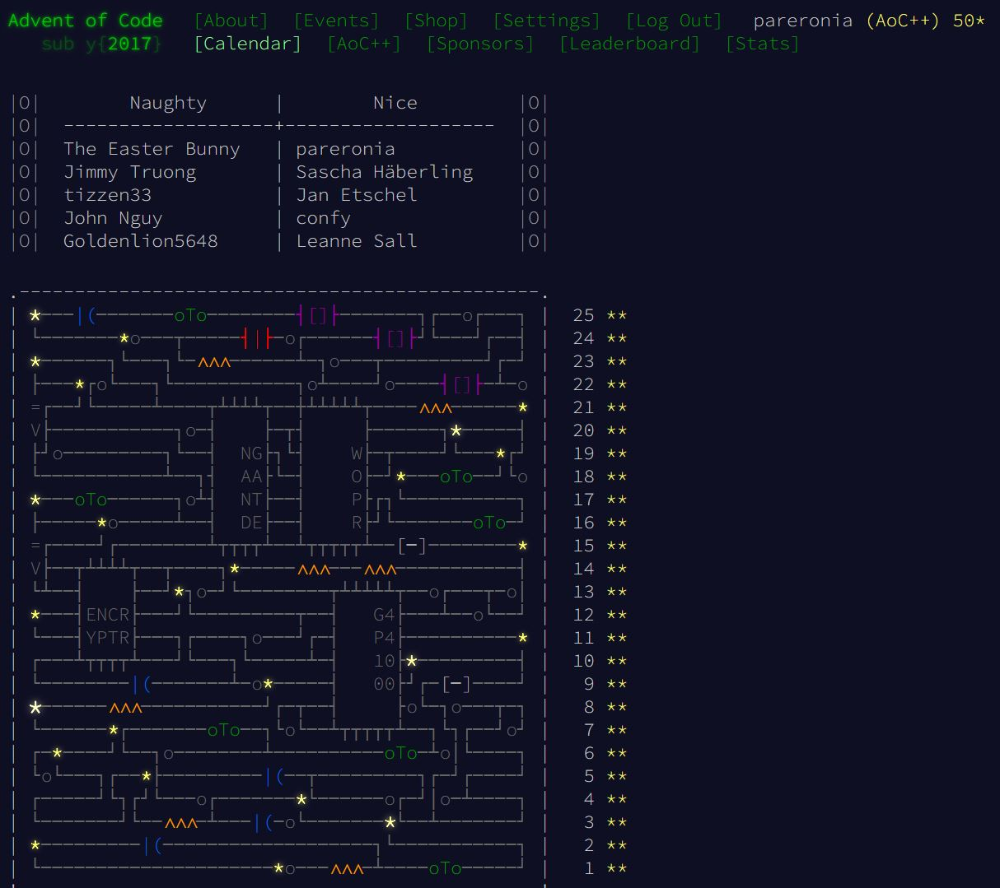

[Advent of Code](https://adventofcode.com)

## 2023

<!-- @BEGIN:ImplementationsTable:2023@ -->
| | 1 | 2 | 3 | 4 | 5 | 6 | 7 | 8 | 9 | 10 | 11 | 12 | 13 | 14 | 15 | 16 | 17 | 18 | 19 | 20 | 21 | 22 | 23 | 24 | 25 |
| ---| --- | --- | --- | --- | --- | --- | --- | --- | --- | --- | --- | --- | --- | --- | --- | --- | --- | --- | --- | --- | --- | --- | --- | --- | --- |
| python3 | [✓](src/main/python/AoC2023_01.py) | [✓](src/main/python/AoC2023_02.py) |  |  |  |  |  |  |  |  |  |  |  |  |  |  |  |  |  |  |  |  |  |  |  |
| java | [✓](src/main/java/AoC2023_01.java) | [✓](src/main/java/AoC2023_02.java) |  |  |  |  |  |  |  |  |  |  |  |  |  |  |  |  |  |  |  |  |  |  |  |
| bash |  |  |  |  |  |  |  |  |  |  |  |  |  |  |  |  |  |  |  |  |  |  |  |  |  |
| c++ |  |  |  |  |  |  |  |  |  |  |  |  |  |  |  |  |  |  |  |  |  |  |  |  |  |
| julia |  |  |  |  |  |  |  |  |  |  |  |  |  |  |  |  |  |  |  |  |  |  |  |  |  |
| rust |  |  |  |  |  |  |  |  |  |  |  |  |  |  |  |  |  |  |  |  |  |  |  |  |  |
<!-- @END:ImplementationsTable:2023@ -->

## 2022

<!-- @BEGIN:ImplementationsTable:2022@ -->
| | 1 | 2 | 3 | 4 | 5 | 6 | 7 | 8 | 9 | 10 | 11 | 12 | 13 | 14 | 15 | 16 | 17 | 18 | 19 | 20 | 21 | 22 | 23 | 24 | 25 |
| ---| --- | --- | --- | --- | --- | --- | --- | --- | --- | --- | --- | --- | --- | --- | --- | --- | --- | --- | --- | --- | --- | --- | --- | --- | --- |
| python3 | [✓](src/main/python/AoC2022_01.py) | [✓](src/main/python/AoC2022_02.py) | [✓](src/main/python/AoC2022_03.py) | [✓](src/main/python/AoC2022_04.py) | [✓](src/main/python/AoC2022_05.py) | [✓](src/main/python/AoC2022_06.py) | [✓](src/main/python/AoC2022_07.py) | [✓](src/main/python/AoC2022_08.py) | [✓](src/main/python/AoC2022_09.py) | [✓](src/main/python/AoC2022_10.py) | [✓](src/main/python/AoC2022_11.py) | [✓](src/main/python/AoC2022_12.py) | [✓](src/main/python/AoC2022_13.py) | [✓](src/main/python/AoC2022_14.py) | [✓](src/main/python/AoC2022_15.py) | [✓](src/main/python/AoC2022_16.py) |  | [✓](src/main/python/AoC2022_18.py) |  | [✓](src/main/python/AoC2022_20.py) |  | [✓](src/main/python/AoC2022_22.py) | [✓](src/main/python/AoC2022_23.py) |  | [✓](src/main/python/AoC2022_25.py) |
| java | [✓](src/main/java/AoC2022_01.java) | [✓](src/main/java/AoC2022_02.java) | [✓](src/main/java/AoC2022_03.java) | [✓](src/main/java/AoC2022_04.java) | [✓](src/main/java/AoC2022_05.java) | [✓](src/main/java/AoC2022_06.java) | [✓](src/main/java/AoC2022_07.java) | [✓](src/main/java/AoC2022_08.java) | [✓](src/main/java/AoC2022_09.java) | [✓](src/main/java/AoC2022_10.java) | [✓](src/main/java/AoC2022_11.java) | [✓](src/main/java/AoC2022_12.java) | [✓](src/main/java/AoC2022_13.java) | [✓](src/main/java/AoC2022_14.java) | [✓](src/main/java/AoC2022_15.java) | [✓](src/main/java/AoC2022_16.java) | [✓](src/main/java/AoC2022_17.java) | [✓](src/main/java/AoC2022_18.java) | [✓](src/main/java/AoC2022_19.java) | [✓](src/main/java/AoC2022_20.java) | [✓](src/main/java/AoC2022_21.java) | [✓](src/main/java/AoC2022_22.java) | [✓](src/main/java/AoC2022_23.java) | [✓](src/main/java/AoC2022_24.java) | [✓](src/main/java/AoC2022_25.java) |
| bash | [✓](src/main/bash/AoC2022_01.sh) | [✓](src/main/bash/AoC2022_02.sh) | [✓](src/main/bash/AoC2022_03.sh) | [✓](src/main/bash/AoC2022_04.sh) |  | [✓](src/main/bash/AoC2022_06.sh) | [✓](src/main/bash/AoC2022_07.sh) |  |  | [✓](src/main/bash/AoC2022_10.sh) |  |  |  |  |  |  |  |  |  |  |  |  |  |  | [✓](src/main/bash/AoC2022_25.sh) |
| c++ | [✓](src/main/cpp/2022/01/AoC2022_01.cpp) | [✓](src/main/cpp/2022/02/AoC2022_02.cpp) | [✓](src/main/cpp/2022/03/AoC2022_03.cpp) | [✓](src/main/cpp/2022/04/AoC2022_04.cpp) | [✓](src/main/cpp/2022/05/AoC2022_05.cpp) | [✓](src/main/cpp/2022/06/AoC2022_06.cpp) |  |  | [✓](src/main/cpp/2022/09/AoC2022_09.cpp) | [✓](src/main/cpp/2022/10/AoC2022_10.cpp) |  |  |  | [✓](src/main/cpp/2022/14/AoC2022_14.cpp) |  |  |  |  |  |  |  |  | [✓](src/main/cpp/2022/23/AoC2022_23.cpp) | [✓](src/main/cpp/2022/24/AoC2022_24.cpp) | [✓](src/main/cpp/2022/25/AoC2022_25.cpp) |
| julia | [✓](src/main/julia/AoC2022_01.jl) | [✓](src/main/julia/AoC2022_02.jl) | [✓](src/main/julia/AoC2022_03.jl) | [✓](src/main/julia/AoC2022_04.jl) |  | [✓](src/main/julia/AoC2022_06.jl) |  |  |  | [✓](src/main/julia/AoC2022_10.jl) | [✓](src/main/julia/AoC2022_11.jl) |  |  |  |  |  |  |  |  |  |  |  |  |  |  |
| rust | [✓](src/main/rust/AoC2022_01/src/main.rs) | [✓](src/main/rust/AoC2022_02/src/main.rs) | [✓](src/main/rust/AoC2022_03/src/main.rs) | [✓](src/main/rust/AoC2022_04/src/main.rs) | [✓](src/main/rust/AoC2022_05/src/main.rs) | [✓](src/main/rust/AoC2022_06/src/main.rs) | [✓](src/main/rust/AoC2022_07/src/main.rs) | [✓](src/main/rust/AoC2022_08/src/main.rs) | [✓](src/main/rust/AoC2022_09/src/main.rs) | [✓](src/main/rust/AoC2022_10/src/main.rs) | [✓](src/main/rust/AoC2022_11/src/main.rs) | [✓](src/main/rust/AoC2022_12/src/main.rs) | [✓](src/main/rust/AoC2022_13/src/main.rs) | [✓](src/main/rust/AoC2022_14/src/main.rs) |  | [✓](src/main/rust/AoC2022_16/src/main.rs) |  | [✓](src/main/rust/AoC2022_18/src/main.rs) | [✓](src/main/rust/AoC2022_19/src/main.rs) | [✓](src/main/rust/AoC2022_20/src/main.rs) |  |  |  |  | [✓](src/main/rust/AoC2022_25/src/main.rs) |
<!-- @END:ImplementationsTable:2022@ -->

## 2021

<!-- @BEGIN:ImplementationsTable:2021@ -->
| | 1 | 2 | 3 | 4 | 5 | 6 | 7 | 8 | 9 | 10 | 11 | 12 | 13 | 14 | 15 | 16 | 17 | 18 | 19 | 20 | 21 | 22 | 23 | 24 | 25 |
| ---| --- | --- | --- | --- | --- | --- | --- | --- | --- | --- | --- | --- | --- | --- | --- | --- | --- | --- | --- | --- | --- | --- | --- | --- | --- |
| python3 | [✓](src/main/python/AoC2021_01.py) | [✓](src/main/python/AoC2021_02.py) | [✓](src/main/python/AoC2021_03.py) | [✓](src/main/python/AoC2021_04.py) | [✓](src/main/python/AoC2021_05.py) | [✓](src/main/python/AoC2021_06.py) | [✓](src/main/python/AoC2021_07.py) | [✓](src/main/python/AoC2021_08.py) | [✓](src/main/python/AoC2021_09.py) | [✓](src/main/python/AoC2021_10.py) | [✓](src/main/python/AoC2021_11.py) | [✓](src/main/python/AoC2021_12.py) | [✓](src/main/python/AoC2021_13.py) | [✓](src/main/python/AoC2021_14.py) | [✓](src/main/python/AoC2021_15.py) | [✓](src/main/python/AoC2021_16.py) | [✓](src/main/python/AoC2021_17.py) | [✓](src/main/python/AoC2021_18.py) |  | [✓](src/main/python/AoC2021_20.py) | [✓](src/main/python/AoC2021_21.py) | [✓](src/main/python/AoC2021_22.py) | [✓](src/main/python/AoC2021_23.py) | [✓](src/main/python/AoC2021_24.py) | [✓](src/main/python/AoC2021_25.py) |
| java | [✓](src/main/java/AoC2021_01.java) | [✓](src/main/java/AoC2021_02.java) | [✓](src/main/java/AoC2021_03.java) | [✓](src/main/java/AoC2021_04.java) | [✓](src/main/java/AoC2021_05.java) | [✓](src/main/java/AoC2021_06.java) | [✓](src/main/java/AoC2021_07.java) | [✓](src/main/java/AoC2021_08.java) | [✓](src/main/java/AoC2021_09.java) | [✓](src/main/java/AoC2021_10.java) | [✓](src/main/java/AoC2021_11.java) | [✓](src/main/java/AoC2021_12.java) | [✓](src/main/java/AoC2021_13.java) | [✓](src/main/java/AoC2021_14.java) | [✓](src/main/java/AoC2021_15.java) | [✓](src/main/java/AoC2021_16.java) | [✓](src/main/java/AoC2021_17.java) | [✓](src/main/java/AoC2021_18.java) | [✓](src/main/java/AoC2021_19.java) | [✓](src/main/java/AoC2021_20.java) | [✓](src/main/java/AoC2021_21.java) | [✓](src/main/java/AoC2021_22.java) | [✓](src/main/java/AoC2021_23.java) | [✓](src/main/java/AoC2021_24.java) | [✓](src/main/java/AoC2021_25.java) |
| bash | [✓](src/main/bash/AoC2021_01.sh) | [✓](src/main/bash/AoC2021_02.sh) |  |  |  |  |  |  |  |  |  |  | [✓](src/main/bash/AoC2021_13.sh) |  |  |  |  |  |  |  |  |  |  |  |  |
| c++ | [✓](src/main/cpp/2021/01/AoC2021_01.cpp) | [✓](src/main/cpp/2021/02/AoC2021_02.cpp) | [✓](src/main/cpp/2021/03/AoC2021_03.cpp) | [✓](src/main/cpp/2021/04/AoC2021_04.cpp) | [✓](src/main/cpp/2021/05/AoC2021_05.cpp) | [✓](src/main/cpp/2021/06/AoC2021_06.cpp) | [✓](src/main/cpp/2021/07/AoC2021_07.cpp) |  | [✓](src/main/cpp/2021/09/AoC2021_09.cpp) |  | [✓](src/main/cpp/2021/11/AoC2021_11.cpp) |  | [✓](src/main/cpp/2021/13/AoC2021_13.cpp) | [✓](src/main/cpp/2021/14/AoC2021_14.cpp) | [✓](src/main/cpp/2021/15/AoC2021_15.cpp) |  |  |  |  |  |  |  |  |  |  |
| julia | [✓](src/main/julia/AoC2021_01.jl) | [✓](src/main/julia/AoC2021_02.jl) | [✓](src/main/julia/AoC2021_03.jl) | [✓](src/main/julia/AoC2021_04.jl) | [✓](src/main/julia/AoC2021_05.jl) | [✓](src/main/julia/AoC2021_06.jl) | [✓](src/main/julia/AoC2021_07.jl) | [✓](src/main/julia/AoC2021_08.jl) | [✓](src/main/julia/AoC2021_09.jl) | [✓](src/main/julia/AoC2021_10.jl) | [✓](src/main/julia/AoC2021_11.jl) |  |  |  |  |  |  |  |  |  |  |  |  |  |  |
| rust |  |  |  |  |  |  |  |  |  |  |  |  |  |  |  |  |  |  |  |  |  |  |  |  |  |
<!-- @END:ImplementationsTable:2021@ -->

## 2020

<!-- @BEGIN:ImplementationsTable:2020@ -->
| | 1 | 2 | 3 | 4 | 5 | 6 | 7 | 8 | 9 | 10 | 11 | 12 | 13 | 14 | 15 | 16 | 17 | 18 | 19 | 20 | 21 | 22 | 23 | 24 | 25 |
| ---| --- | --- | --- | --- | --- | --- | --- | --- | --- | --- | --- | --- | --- | --- | --- | --- | --- | --- | --- | --- | --- | --- | --- | --- | --- |
| python3 | [✓](src/main/python/AoC2020_01.py) | [✓](src/main/python/AoC2020_02.py) | [✓](src/main/python/AoC2020_03.py) | [✓](src/main/python/AoC2020_04.py) | [✓](src/main/python/AoC2020_05.py) | [✓](src/main/python/AoC2020_06.py) | [✓](src/main/python/AoC2020_07.py) | [✓](src/main/python/AoC2020_08.py) | [✓](src/main/python/AoC2020_09.py) | [✓](src/main/python/AoC2020_10.py) | [✓](src/main/python/AoC2020_11.py) | [✓](src/main/python/AoC2020_12.py) | [✓](src/main/python/AoC2020_13.py) | [✓](src/main/python/AoC2020_14.py) | [✓](src/main/python/AoC2020_15.py) | [✓](src/main/python/AoC2020_16.py) | [✓](src/main/python/AoC2020_17.py) | [✓](src/main/python/AoC2020_18.py) | [✓](src/main/python/AoC2020_19.py) | [✓](src/main/python/AoC2020_20.py) | [✓](src/main/python/AoC2020_21.py) | [✓](src/main/python/AoC2020_22.py) | [✓](src/main/python/AoC2020_23.py) | [✓](src/main/python/AoC2020_24.py) | [✓](src/main/python/AoC2020_25.py) |
| java | [✓](src/main/java/AoC2020_01.java) | [✓](src/main/java/AoC2020_02.java) | [✓](src/main/java/AoC2020_03.java) | [✓](src/main/java/AoC2020_04.java) | [✓](src/main/java/AoC2020_05.java) | [✓](src/main/java/AoC2020_06.java) | [✓](src/main/java/AoC2020_07.java) | [✓](src/main/java/AoC2020_08.java) | [✓](src/main/java/AoC2020_09.java) | [✓](src/main/java/AoC2020_10.java) | [✓](src/main/java/AoC2020_11.java) | [✓](src/main/java/AoC2020_12.java) | [✓](src/main/java/AoC2020_13.java) | [✓](src/main/java/AoC2020_14.java) | [✓](src/main/java/AoC2020_15.java) | [✓](src/main/java/AoC2020_16.java) | [✓](src/main/java/AoC2020_17.java) | [✓](src/main/java/AoC2020_18.java) |  | [✓](src/main/java/AoC2020_20.java) |  | [✓](src/main/java/AoC2020_22.java) | [✓](src/main/java/AoC2020_23.java) | [✓](src/main/java/AoC2020_24.java) | [✓](src/main/java/AoC2020_25.java) |
| bash |  |  |  |  |  |  |  |  |  |  |  |  |  |  |  |  |  |  |  |  |  |  |  |  |  |
| c++ |  |  |  |  |  |  |  |  |  |  |  |  |  |  |  |  | [✓](src/main/cpp/2020/17/AoC2020_17.cpp) |  |  |  |  |  |  |  |  |
| julia |  |  |  |  | [✓](src/main/julia/AoC2020_05.jl) |  |  |  |  |  |  |  |  |  |  | [✓](src/main/julia/AoC2020_16.jl) | [✓](src/main/julia/AoC2020_17.jl) |  |  |  |  |  |  |  |  |
| rust |  |  |  |  |  |  |  |  |  |  |  |  |  |  |  |  |  |  |  |  |  |  |  |  |  |
<!-- @END:ImplementationsTable:2020@ -->

## 2019

<!-- @BEGIN:ImplementationsTable:2019@ -->
| | 1 | 2 | 3 | 4 | 5 | 6 | 7 | 8 | 9 | 10 | 11 | 12 | 13 | 14 | 15 | 16 | 17 | 18 | 19 | 20 | 21 | 22 | 23 | 24 | 25 |
| ---| --- | --- | --- | --- | --- | --- | --- | --- | --- | --- | --- | --- | --- | --- | --- | --- | --- | --- | --- | --- | --- | --- | --- | --- | --- |
| python3 | [✓](src/main/python/AoC2019_01.py) | [✓](src/main/python/AoC2019_02.py) | [✓](src/main/python/AoC2019_03.py) | [✓](src/main/python/AoC2019_04.py) | [✓](src/main/python/AoC2019_05.py) | [✓](src/main/python/AoC2019_06.py) | [✓](src/main/python/AoC2019_07.py) | [✓](src/main/python/AoC2019_08.py) | [✓](src/main/python/AoC2019_09.py) |  | [✓](src/main/python/AoC2019_11.py) |  | [✓](src/main/python/AoC2019_13.py) |  |  | [✓](src/main/python/AoC2019_16.py) |  |  |  |  |  |  |  |  |  |
| java | [✓](src/main/java/AoC2019_01.java) | [✓](src/main/java/AoC2019_02.java) | [✓](src/main/java/AoC2019_03.java) | [✓](src/main/java/AoC2019_04.java) | [✓](src/main/java/AoC2019_05.java) | [✓](src/main/java/AoC2019_06.java) | [✓](src/main/java/AoC2019_07.java) | [✓](src/main/java/AoC2019_08.java) | [✓](src/main/java/AoC2019_09.java) | [✓](src/main/java/AoC2019_10.java) | [✓](src/main/java/AoC2019_11.java) | [✓](src/main/java/AoC2019_12.java) | [✓](src/main/java/AoC2019_13.java) |  | [✓](src/main/java/AoC2019_15.java) | [✓](src/main/java/AoC2019_16.java) | [✓](src/main/java/AoC2019_17.java) |  |  |  |  |  |  |  |  |
| bash |  |  |  |  |  |  |  | [✓](src/main/bash/AoC2019_08.sh) |  |  |  |  |  |  |  |  |  |  |  |  |  |  |  |  |  |
| c++ |  |  |  |  |  |  |  | [✓](src/main/cpp/2019/08/AoC2019_08.cpp) |  |  |  |  |  |  |  |  |  |  |  |  |  |  |  |  |  |
| julia |  |  |  |  |  |  |  |  |  |  |  |  |  |  |  |  |  |  |  |  |  |  |  |  |  |
| rust | [✓](src/main/rust/AoC2019_01/src/main.rs) |  |  |  |  |  |  | [✓](src/main/rust/AoC2019_08/src/main.rs) |  |  |  |  |  |  |  | [✓](src/main/rust/AoC2019_16/src/main.rs) |  |  |  |  |  |  |  |  |  |
<!-- @END:ImplementationsTable:2019@ -->

## 2018

<!-- @BEGIN:ImplementationsTable:2018@ -->
| | 1 | 2 | 3 | 4 | 5 | 6 | 7 | 8 | 9 | 10 | 11 | 12 | 13 | 14 | 15 | 16 | 17 | 18 | 19 | 20 | 21 | 22 | 23 | 24 | 25 |
| ---| --- | --- | --- | --- | --- | --- | --- | --- | --- | --- | --- | --- | --- | --- | --- | --- | --- | --- | --- | --- | --- | --- | --- | --- | --- |
| python3 |  |  |  |  |  |  |  |  |  |  |  |  |  |  |  |  |  |  |  |  |  |  |  |  |  |
| java |  |  |  |  |  |  |  |  |  |  |  |  |  |  |  |  |  |  |  |  |  |  |  |  |  |
| bash |  |  |  |  |  |  |  |  |  |  |  |  |  |  |  |  |  |  |  |  |  |  |  |  |  |
| c++ |  |  |  |  |  |  |  |  |  |  |  |  |  |  |  |  |  |  |  |  |  |  |  |  |  |
| julia |  |  |  |  |  |  |  |  |  |  |  |  |  |  |  |  |  |  |  |  |  |  |  |  |  |
| rust |  |  |  |  |  |  |  |  |  |  |  |  |  |  |  |  |  |  |  |  |  |  |  |  |  |
<!-- @END:ImplementationsTable:2018@ -->

## 2017

<!-- @BEGIN:ImplementationsTable:2017@ -->
| | 1 | 2 | 3 | 4 | 5 | 6 | 7 | 8 | 9 | 10 | 11 | 12 | 13 | 14 | 15 | 16 | 17 | 18 | 19 | 20 | 21 | 22 | 23 | 24 | 25 |
| ---| --- | --- | --- | --- | --- | --- | --- | --- | --- | --- | --- | --- | --- | --- | --- | --- | --- | --- | --- | --- | --- | --- | --- | --- | --- |
| python3 | [✓](src/main/python/AoC2017_01.py) | [✓](src/main/python/AoC2017_02.py) | [✓](src/main/python/AoC2017_03.py) | [✓](src/main/python/AoC2017_04.py) | [✓](src/main/python/AoC2017_05.py) | [✓](src/main/python/AoC2017_06.py) |  | [✓](src/main/python/AoC2017_08.py) |  | [✓](src/main/python/AoC2017_10.py) | [✓](src/main/python/AoC2017_11.py) |  | [✓](src/main/python/AoC2017_13.py) | [✓](src/main/python/AoC2017_14.py) | [✓](src/main/python/AoC2017_15.py) | [✓](src/main/python/AoC2017_16.py) |  |  |  | [✓](src/main/python/AoC2017_20.py) |  | [✓](src/main/python/AoC2017_22.py) | [✓](src/main/python/AoC2017_23.py) |  | [✓](src/main/python/AoC2017_25.py) |
| java | [✓](src/main/java/AoC2017_01.java) | [✓](src/main/java/AoC2017_02.java) | [✓](src/main/java/AoC2017_03.java) | [✓](src/main/java/AoC2017_04.java) | [✓](src/main/java/AoC2017_05.java) | [✓](src/main/java/AoC2017_06.java) | [✓](src/main/java/AoC2017_07.java) | [✓](src/main/java/AoC2017_08.java) | [✓](src/main/java/AoC2017_09.java) | [✓](src/main/java/AoC2017_10.java) | [✓](src/main/java/AoC2017_11.java) | [✓](src/main/java/AoC2017_12.java) | [✓](src/main/java/AoC2017_13.java) | [✓](src/main/java/AoC2017_14.java) | [✓](src/main/java/AoC2017_15.java) | [✓](src/main/java/AoC2017_16.java) | [✓](src/main/java/AoC2017_17.java) | [✓](src/main/java/AoC2017_18.java) | [✓](src/main/java/AoC2017_19.java) | [✓](src/main/java/AoC2017_20.java) | [✓](src/main/java/AoC2017_21.java) | [✓](src/main/java/AoC2017_22.java) | [✓](src/main/java/AoC2017_23.java) | [✓](src/main/java/AoC2017_24.java) | [✓](src/main/java/AoC2017_25.java) |
| bash | [✓](src/main/bash/AoC2017_01.sh) | [✓](src/main/bash/AoC2017_02.sh) |  | [✓](src/main/bash/AoC2017_04.sh) | [✓](src/main/bash/AoC2017_05.sh) |  |  |  |  |  |  |  |  |  |  |  |  |  |  |  |  |  |  |  |  |
| c++ | [✓](src/main/cpp/2017/01/AoC2017_01.cpp) | [✓](src/main/cpp/2017/02/AoC2017_02.cpp) | [✓](src/main/cpp/2017/03/AoC2017_03.cpp) | [✓](src/main/cpp/2017/04/AoC2017_04.cpp) | [✓](src/main/cpp/2017/05/AoC2017_05.cpp) |  |  |  | [✓](src/main/cpp/2017/09/AoC2017_09.cpp) |  | [✓](src/main/cpp/2017/11/AoC2017_11.cpp) |  | [✓](src/main/cpp/2017/13/AoC2017_13.cpp) |  |  |  |  | [✓](src/main/cpp/2017/18/AoC2017_18.cpp) |  |  | [✓](src/main/cpp/2017/21/AoC2017_21.cpp) |  |  |  | [✓](src/main/cpp/2017/25/AoC2017_25.cpp) |
| julia | [✓](src/main/julia/AoC2017_01.jl) | [✓](src/main/julia/AoC2017_02.jl) | [✓](src/main/julia/AoC2017_03.jl) | [✓](src/main/julia/AoC2017_04.jl) |  |  |  |  |  |  |  |  | [✓](src/main/julia/AoC2017_13.jl) |  |  |  |  |  |  |  |  |  |  |  |  |
| rust |  |  |  |  |  |  |  |  |  |  |  |  |  |  |  |  |  |  |  |  |  |  |  |  |  |
<!-- @END:ImplementationsTable:2017@ -->

## 2016

<!-- @BEGIN:ImplementationsTable:2016@ -->
| | 1 | 2 | 3 | 4 | 5 | 6 | 7 | 8 | 9 | 10 | 11 | 12 | 13 | 14 | 15 | 16 | 17 | 18 | 19 | 20 | 21 | 22 | 23 | 24 | 25 |
| ---| --- | --- | --- | --- | --- | --- | --- | --- | --- | --- | --- | --- | --- | --- | --- | --- | --- | --- | --- | --- | --- | --- | --- | --- | --- |
| python3 | [✓](src/main/python/AoC2016_01.py) | [✓](src/main/python/AoC2016_02.py) | [✓](src/main/python/AoC2016_03.py) | [✓](src/main/python/AoC2016_04.py) | [✓](src/main/python/AoC2016_05.py) | [✓](src/main/python/AoC2016_06.py) | [✓](src/main/python/AoC2016_07.py) |  | [✓](src/main/python/AoC2016_09.py) |  |  | [✓](src/main/python/AoC2016_12.py) |  |  | [✓](src/main/python/AoC2016_15.py) | [✓](src/main/python/AoC2016_16.py) |  | [✓](src/main/python/AoC2016_18.py) | [✓](src/main/python/AoC2016_19.py) | [✓](src/main/python/AoC2016_20.py) | [✓](src/main/python/AoC2016_21.py) | [✓](src/main/python/AoC2016_22.py) | [✓](src/main/python/AoC2016_23.py) |  | [✓](src/main/python/AoC2016_25.py) |
| java | [✓](src/main/java/AoC2016_01.java) | [✓](src/main/java/AoC2016_02.java) | [✓](src/main/java/AoC2016_03.java) | [✓](src/main/java/AoC2016_04.java) | [✓](src/main/java/AoC2016_05.java) | [✓](src/main/java/AoC2016_06.java) | [✓](src/main/java/AoC2016_07.java) | [✓](src/main/java/AoC2016_08.java) | [✓](src/main/java/AoC2016_09.java) | [✓](src/main/java/AoC2016_10.java) | [✓](src/main/java/AoC2016_11.java) | [✓](src/main/java/AoC2016_12.java) | [✓](src/main/java/AoC2016_13.java) | [✓](src/main/java/AoC2016_14.java) | [✓](src/main/java/AoC2016_15.java) | [✓](src/main/java/AoC2016_16.java) | [✓](src/main/java/AoC2016_17.java) | [✓](src/main/java/AoC2016_18.java) | [✓](src/main/java/AoC2016_19.java) | [✓](src/main/java/AoC2016_20.java) | [✓](src/main/java/AoC2016_21.java) | [✓](src/main/java/AoC2016_22.java) | [✓](src/main/java/AoC2016_23.java) | [✓](src/main/java/AoC2016_24.java) | [✓](src/main/java/AoC2016_25.java) |
| bash | [✓](src/main/bash/AoC2016_01.sh) | [✓](src/main/bash/AoC2016_02.sh) | [✓](src/main/bash/AoC2016_03.sh) | [✓](src/main/bash/AoC2016_04.sh) |  | [✓](src/main/bash/AoC2016_06.sh) | [✓](src/main/bash/AoC2016_07.sh) | [✓](src/main/bash/AoC2016_08.sh) | [✓](src/main/bash/AoC2016_09.sh) |  |  |  |  |  |  |  |  |  |  |  |  |  |  |  |  |
| c++ |  |  |  |  |  |  |  | [✓](src/main/cpp/2016/08/AoC2016_08.cpp) |  |  |  |  | [✓](src/main/cpp/2016/13/AoC2016_13.cpp) |  |  |  |  |  |  |  |  |  |  |  |  |
| julia |  |  |  |  |  |  |  |  |  |  |  |  |  |  |  |  |  |  |  |  |  |  |  |  |  |
| rust |  | [✓](src/main/rust/AoC2016_02/src/main.rs) |  |  |  |  |  |  |  |  |  |  | [✓](src/main/rust/AoC2016_13/src/main.rs) |  |  |  |  |  |  |  |  |  |  |  |  |
<!-- @END:ImplementationsTable:2016@ -->

## 2015

<!-- @BEGIN:ImplementationsTable:2015@ -->
| | 1 | 2 | 3 | 4 | 5 | 6 | 7 | 8 | 9 | 10 | 11 | 12 | 13 | 14 | 15 | 16 | 17 | 18 | 19 | 20 | 21 | 22 | 23 | 24 | 25 |
| ---| --- | --- | --- | --- | --- | --- | --- | --- | --- | --- | --- | --- | --- | --- | --- | --- | --- | --- | --- | --- | --- | --- | --- | --- | --- |
| python3 | [✓](src/main/python/AoC2015_01.py) | [✓](src/main/python/AoC2015_02.py) | [✓](src/main/python/AoC2015_03.py) | [✓](src/main/python/AoC2015_04.py) | [✓](src/main/python/AoC2015_05.py) | [✓](src/main/python/AoC2015_06.py) |  | [✓](src/main/python/AoC2015_08.py) | [✓](src/main/python/AoC2015_09.py) | [✓](src/main/python/AoC2015_10.py) | [✓](src/main/python/AoC2015_11.py) | [✓](src/main/python/AoC2015_12.py) | [✓](src/main/python/AoC2015_13.py) | [✓](src/main/python/AoC2015_14.py) | [✓](src/main/python/AoC2015_15.py) | [✓](src/main/python/AoC2015_16.py) | [✓](src/main/python/AoC2015_17.py) | [✓](src/main/python/AoC2015_18.py) | [✓](src/main/python/AoC2015_19.py) |  |  |  | [✓](src/main/python/AoC2015_23.py) | [✓](src/main/python/AoC2015_24.py) | [✓](src/main/python/AoC2015_25.py) |
| java | [✓](src/main/java/AoC2015_01.java) | [✓](src/main/java/AoC2015_02.java) | [✓](src/main/java/AoC2015_03.java) | [✓](src/main/java/AoC2015_04.java) | [✓](src/main/java/AoC2015_05.java) | [✓](src/main/java/AoC2015_06.java) | [✓](src/main/java/AoC2015_07.java) | [✓](src/main/java/AoC2015_08.java) | [✓](src/main/java/AoC2015_09.java) | [✓](src/main/java/AoC2015_10.java) | [✓](src/main/java/AoC2015_11.java) | [✓](src/main/java/AoC2015_12.java) | [✓](src/main/java/AoC2015_13.java) | [✓](src/main/java/AoC2015_14.java) | [✓](src/main/java/AoC2015_15.java) | [✓](src/main/java/AoC2015_16.java) | [✓](src/main/java/AoC2015_17.java) | [✓](src/main/java/AoC2015_18.java) | [✓](src/main/java/AoC2015_19.java) | [✓](src/main/java/AoC2015_20.java) | [✓](src/main/java/AoC2015_21.java) | [✓](src/main/java/AoC2015_22.java) |  |  |  |
| bash | [✓](src/main/bash/AoC2015_01.sh) | [✓](src/main/bash/AoC2015_02.sh) | [✓](src/main/bash/AoC2015_03.sh) | [✓](src/main/bash/AoC2015_04.sh) | [✓](src/main/bash/AoC2015_05.sh) |  |  |  | [✓](src/main/bash/AoC2015_09.sh) | [✓](src/main/bash/AoC2015_10.sh) |  |  |  | [✓](src/main/bash/AoC2015_14.sh) |  |  |  |  |  |  |  |  |  |  |  |
| c++ | [✓](src/main/cpp/2015/01/AoC2015_01.cpp) | [✓](src/main/cpp/2015/02/AoC2015_02.cpp) | [✓](src/main/cpp/2015/03/AoC2015_03.cpp) | [✓](src/main/cpp/2015/04/AoC2015_04.cpp) | [✓](src/main/cpp/2015/05/AoC2015_05.cpp) | [✓](src/main/cpp/2015/06/AoC2015_06.cpp) |  |  |  |  |  |  |  |  |  |  |  |  |  |  |  |  |  |  |  |
| julia | [✓](src/main/julia/AoC2015_01.jl) | [✓](src/main/julia/AoC2015_02.jl) | [✓](src/main/julia/AoC2015_03.jl) | [✓](src/main/julia/AoC2015_04.jl) | [✓](src/main/julia/AoC2015_05.jl) | [✓](src/main/julia/AoC2015_06.jl) |  |  |  |  |  |  |  |  |  |  |  |  |  |  |  |  |  |  |  |
| rust | [✓](src/main/rust/AoC2015_01/src/main.rs) | [✓](src/main/rust/AoC2015_02/src/main.rs) | [✓](src/main/rust/AoC2015_03/src/main.rs) | [✓](src/main/rust/AoC2015_04/src/main.rs) | [✓](src/main/rust/AoC2015_05/src/main.rs) |  |  |  | [✓](src/main/rust/AoC2015_09/src/main.rs) |  | [✓](src/main/rust/AoC2015_11/src/main.rs) |  | [✓](src/main/rust/AoC2015_13/src/main.rs) |  | [✓](src/main/rust/AoC2015_15/src/main.rs) | [✓](src/main/rust/AoC2015_16/src/main.rs) |  |  |  |  |  |  |  |  |  |
<!-- @END:ImplementationsTable:2015@ -->
